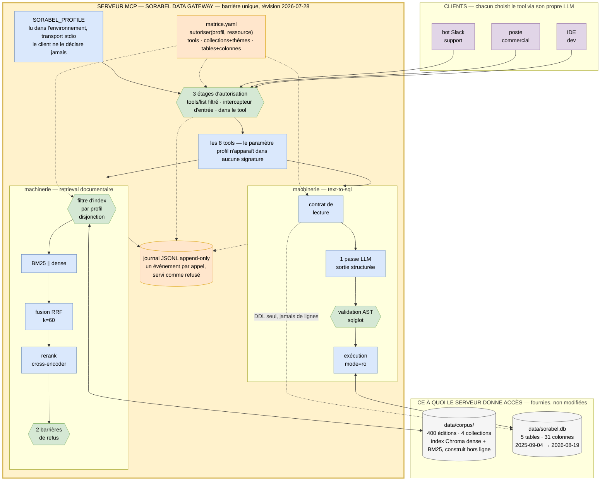

# Schéma du flux complet

> Ce document est le **livrable** « schéma de flux complet » du brief : corpus + base SQL →
> ingestion/indexation → retrieval hybride + rerank → serveur MCP → clients.
> C'est un **synoptique d'une page**. Il montre l'enchaînement et l'emplacement des
> barrières, pas le détail interne des chantiers — celui-ci vit dans les deux schémas de
> chantier, référencés au §4.
>
> Même contenu en drawio : [`01-flux-complet.drawio`](01-flux-complet.drawio).

## 1. Le schéma

**Lecture : le serveur MCP est une barrière, pas une étape parmi d'autres.** Les clients
sont **au-dessus** — c'est leur LLM qui choisit le tool ; les ressources sont **en
dessous** — c'est ce à quoi le serveur donne accès, jamais directement. Toute la mécanique
qui régule l'ensemble (profil, matrice, retrieval, text-to-sql, journal) est **à
l'intérieur** de la bande gateway : rien ne la traverse sans passer par elle.

## 2. Comment lire le schéma

**Trois bandes, empilées comme le sujet le veut : qui appelle au-dessus, ce à quoi on
accède en dessous, et au milieu la barrière qui décide.**

| Bande | Contenu | Ce qu'elle dit |
|---|---|---|
| **CLIENTS** (haut) | bot Slack support, poste commercial, IDE dev | ce sont eux qui choisissent le tool — le serveur ne pousse rien |
| **SERVEUR MCP** (milieu, encadré épais) | profil, étages d'autorisation, matrice, les deux machineries, les 8 tools, le journal | **rien ne passe sans traverser cette bande** — c'est la seule barrière, il n'y en a pas d'autre |
| **SOURCES** (bas) | `data/corpus/` et `data/sorabel.db` | ce à quoi le serveur donne accès — jamais atteint directement par un client |

| Couleur | Ce qu'elle marque | Nœuds |
|---|---|---|
| gris | **source fournie**, jamais modifiée | `data/corpus/` · `data/sorabel.db` |
| bleu | **traitement** — il transforme, il ne décide pas | hybride, RRF, rerank, passe LLM, contrat, exécution, `PROFIL`, `TOOLS` |
| **vert** | **barrière de gouvernance** — elle a le pouvoir d'arrêter | filtre d'index, 2 barrières de refus, AST, 3 étages |
| orange | **configuration et trace** — ni traitement ni barrière | `matrice.yaml`, journal |
| violet | **client** — hors du serveur, il choisit le tool | bot Slack, poste commercial, IDE |
| jaune, bordure épaisse | **la barrière elle-même** — le cadre du serveur MCP | l'encadré `GATEWAY` |

Les traits **pleins** portent la donnée ou l'appel ; les traits **pointillés** portent une
décision, une configuration ou une trace — rien de métier n'y circule.

## 3. Les quatre invariants que ce schéma rend visibles

1. **Un seul serveur, une seule barrière, quatre profils.** La duplication que le brief veut
   supprimer disparaît parce que le périmètre est une **donnée** (`matrice.yaml`), pas une
   instance par équipe. Le profil est lu dans l'environnement : il n'existe nulle part dans
   ce que le LLM du client manipule, donc ce dernier ne peut pas le réécrire.
2. **Aucun client, aucune source ne se touchent directement.** Les clients n'atteignent que
   la bande gateway ; le corpus et la base ne sont lus que depuis l'intérieur de cette bande.
   C'est ce qui rend la matrice **incontournable**, pas seulement présente.
3. **La base ne donne son DDL qu'au prompt, jamais ses lignes.** Le trait pointillé
   `contrat de lecture → base` est délibérément distinct du trait plein `exécution ↔ base` :
   aucun échantillon de données n'entre dans le prompt, sans quoi `prix_achat_ht` fuirait en
   amont de toute validation.
4. **Tout aboutit au journal, servi comme refusé.** Un appel non journalisé est un appel non
   servi : E5 n'admet pas d'exception. Le champ `etage` est ce qui rend la défense en
   profondeur vérifiable *après coup*.

## 4. Pour le détail des chantiers

Ce synoptique s'arrête volontairement au grain de l'étape. Le détail est ailleurs :

| Ce qu'on cherche | Où |
|---|---|
| ingestion, hybride, RRF, rerank, refus documentaires, en détail | [`1-rag-avance/schema-rag-avance_V2.drawio`](../1-rag-avance/schema-rag-avance_V2.drawio) |
| chemin Text-to-SQL complet, avec les refus, les sorties latérales et les pannes | [`04-chemin-text-to-sql.drawio`](04-chemin-text-to-sql.drawio) (V3) et son diagramme de séquence [`04-chemin-text-to-sql.md`](04-chemin-text-to-sql.md) |
| les 8 tools, leurs entrées, sorties et garanties | [`03-catalogue-tools.drawio`](03-catalogue-tools.drawio) et [`03-catalogue-tools.md`](03-catalogue-tools.md) |
| qui a droit à quoi, exactement | [`05-matrice-acces.drawio`](05-matrice-acces.drawio) et [`matrice.yaml`](matrice.yaml) |
| ce qui entre dans l'index | [`02-modele-chunk.md`](02-modele-chunk.md) |

## Renvois

- décisions du chantier documentaire : [`1-rag-avance/`](../1-rag-avance/) `Q1` → `Q5`
- décisions du chantier SQL : [`2-text-to-sql/`](../2-text-to-sql/) `Q1` → `Q5`
- décisions d'exposition : [`3-exposition-mcp-et-matrice-d-acces/`](../3-exposition-mcp-et-matrice-d-acces/) `Q1` → `Q5`
- synthèse d'ensemble : [`synthese-conception.md`](../synthese-conception.md)
