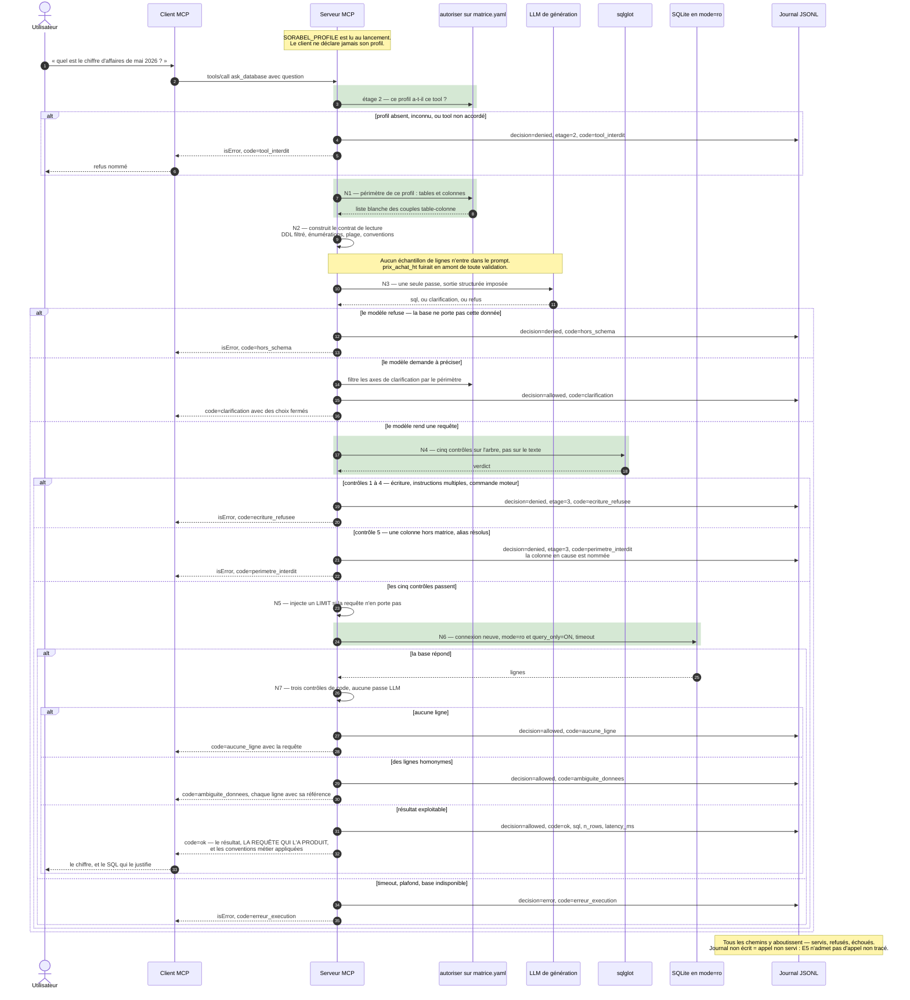

# Chemin Text-to-SQL — diagramme de séquence

> Ce document est le **livrable** « chemin Text-to-SQL » du brief, dans sa forme séquence :
> question → génération → validation → exécution lecture seule → **résultat + requête**.
>
> Le schéma de flux du même chemin, avec ses refus, ses sorties latérales et ses pannes, est
> en drawio : [`04-chemin-text-to-sql.drawio`](04-chemin-text-to-sql.drawio) (**V3**).
> Les décisions sont argumentées dans [`2-text-to-sql/`](../2-text-to-sql/) `Q1` → `Q5`.

## 1. Le chemin nominal, et ses huit sorties

Un diagramme de séquence dit **qui parle à qui, et dans quel ordre** — ce que le schéma de
flux ne montre pas. On y lit en particulier que **le LLM n'est appelé qu'une fois**, et
qu'il est appelé **après** que la matrice a borné le périmètre, jamais avant.

## 2. Ce que la séquence montre et que le flux ne montrait pas

| Fait rendu visible | Pourquoi il compte |
|---|---|
| **la matrice parle avant le LLM** — étage 2, puis N1, puis seulement N3 | le modèle ne voit jamais une colonne interdite : elle n'est pas dans le contrat qu'on lui donne. Le contrôle 5 de l'AST rattrape ce qu'il **invente** hors du contrat, pas ce qu'on lui a montré |
| **un seul aller-retour avec le LLM** | pas de boucle de correction, pas de second appel. La sortie est structurée à trois branches, et le code ajoute la quatrième décision *après* exécution |
| **`sqlglot` est consulté, il ne décide pas seul** | il rend un verdict sur l'arbre ; c'est le serveur qui traduit ce verdict en code, en journal et en réponse |
| **la connexion est ouverte tard, et pour une seule requête** | elle est neuve à chaque appel : aucun état de connexion ne survit d'un appel au suivant |
| **le journal est écrit avant la réponse**, sur les huit sorties | un refus non journalisé serait indétectable ; c'est l'ordre des flèches qui le garantit |

## 3. Les trois autres tools SQL, sur le même chemin

`ask_database` est **le seul** qui produise du SQL, donc le seul à traverser N3 et N4.

| Tool | Étapes traversées | Ce qu'il saute, et pourquoi |
|---|---|---|
| `ask_database` | étage 2 · N1 · N2 · N3 · N4 · N5 · N6 · N7 | — |
| `get_schema` | étage 2 · N1 · N2 → **s'arrête** | il rend le **contrat de lecture** lui-même. Aucun SQL n'est généré : un client peut vouloir composer sa question sans rien déclencher |
| `check_stock` | étage 2 · N1 · N6 · N7 | sa requête est **écrite d'avance** : ni schéma à fournir, ni modèle à appeler, ni arbre à valider |
| `order_status` | étage 2 · N1 · N6 · N7 | idem |

**Les quatre passent par l'étage 2 et par N1, et les quatre aboutissent au journal.** Ce qui
change d'un tool à l'autre, c'est **quand** leur périmètre est vérifié — pas **s'il** l'est.

## 4. Les quatre tests d'acceptance du volet, et l'étape qui les fait passer

| Test | Attendu | Étape |
|---|---|---|
| **T1** | le résultat est rendu avec la requête qui l'a produit | la réponse `ok` porte `sql` |
| **T2** | une demande d'écriture est refusée, et journalisée | N4 contrôles 1 à 4 → `ecriture_refusee` + journal |
| **T3** | les marges sont refusées au profil support | N4 contrôle 5 → `perimetre_interdit`, colonne nommée |
| **T4** | une question hors schéma est refusée | branche `refus` de N3 → `hors_schema`, aucune requête produite ni tentée |

## Renvois

- schéma de flux, V3 : [`04-chemin-text-to-sql.drawio`](04-chemin-text-to-sql.drawio)
- de la question à la requête : [`2-text-to-sql/Q1.md`](../2-text-to-sql/Q1.md)
- les quatre couches de la lecture seule : [`2-text-to-sql/Q2.md`](../2-text-to-sql/Q2.md)
- périmètre par profil, alias, `SELECT *` : [`2-text-to-sql/Q3.md`](../2-text-to-sql/Q3.md)
- les tools figés : [`2-text-to-sql/Q4.md`](../2-text-to-sql/Q4.md)
- question ambiguë ou hors schéma : [`2-text-to-sql/Q5.md`](../2-text-to-sql/Q5.md)
- les douze codes : [`03-catalogue-tools.md`](03-catalogue-tools.md) §codes
- pièce factuelle sur la base : [`2-text-to-sql/description-base.md`](../2-text-to-sql/description-base.md)
