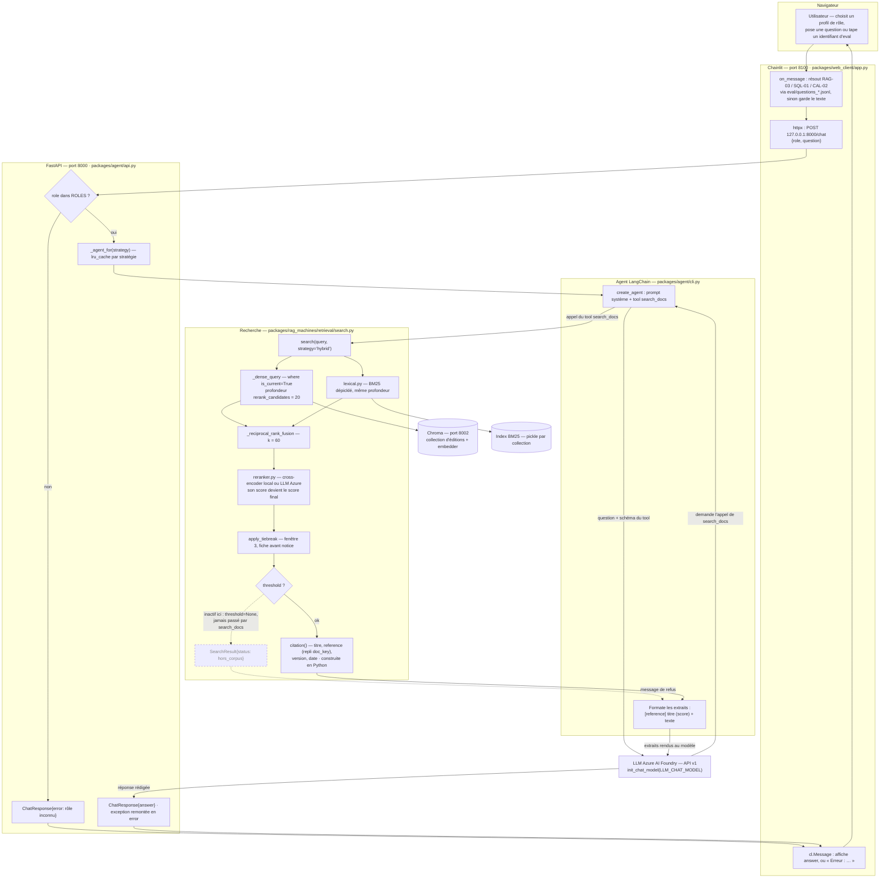
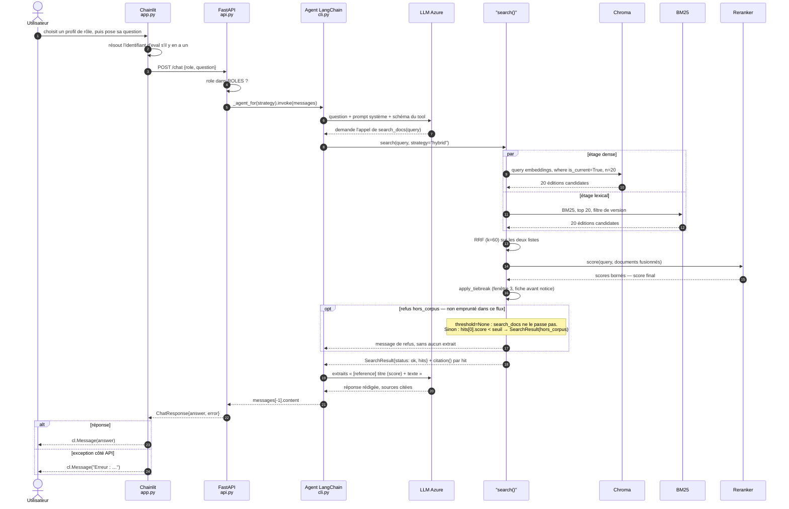

# Flux actuel — de la question Chainlit à la réponse restituée (2026-09-03)

Ce document décrit le chemin **tel qu'il est aujourd'hui**, à la clôture du chantier RAG :
interface Chainlit → API FastAPI → agent LangChain → couche de recherche. Ce n'est pas le
flux cible du dossier de conception (`01-flux-complet.md`), qui passe par le serveur MCP —
celui-ci n'existe pas encore, et la matrice d'accès n'est donc appliquée nulle part.

Deux écarts sont représentés explicitement, parce qu'ils comptent pour la démo :

- **le rôle n'est qu'une étiquette** transmise à l'API, aucun filtrage ne s'appuie dessus ;
- **la barrière de refus `hors_corpus` n'est pas empruntée** : le tool `search_docs` appelle
  `search()` sans `threshold`, dont la valeur par défaut est `None`. E1 ne tient ici que par
  le prompt système. Voir `docs/2026-09-03-points-ouverts-fin-chantier-rag.md` §2.

## 1. Schéma de flux

## 2. Diagramme de séquence

## 3. Écarts avec le flux cible

| point | flux actuel | flux cible (dossier de conception) |
|---|---|---|
| point d'entrée | API FastAPI privée, un seul tool | serveur MCP, catalogue complet de huit tools |
| tools RAG | `search_docs` uniquement, interne à l'agent | `answer_question`, `search_docs`, `get_document`, `list_sources` |
| rôle | étiquette transmise, sans effet | matrice d'accès appliquée à l'entrée et dans chaque tool (E4) |
| refus | seuil non branché ; une seule barrière existe dans le code | `hors_corpus` **et** `contexte_insuffisant`, tous deux actifs (E1) |
| citation | construite par `citation()`, restituée par le modèle dans sa prose | champ `sources` structuré de l'enveloppe de réponse |
| journalisation | aucune | tout appel journalisé, autorisé comme refusé (E5) |
