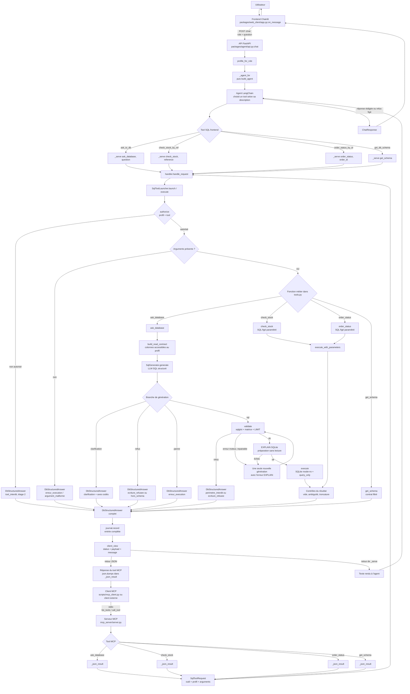
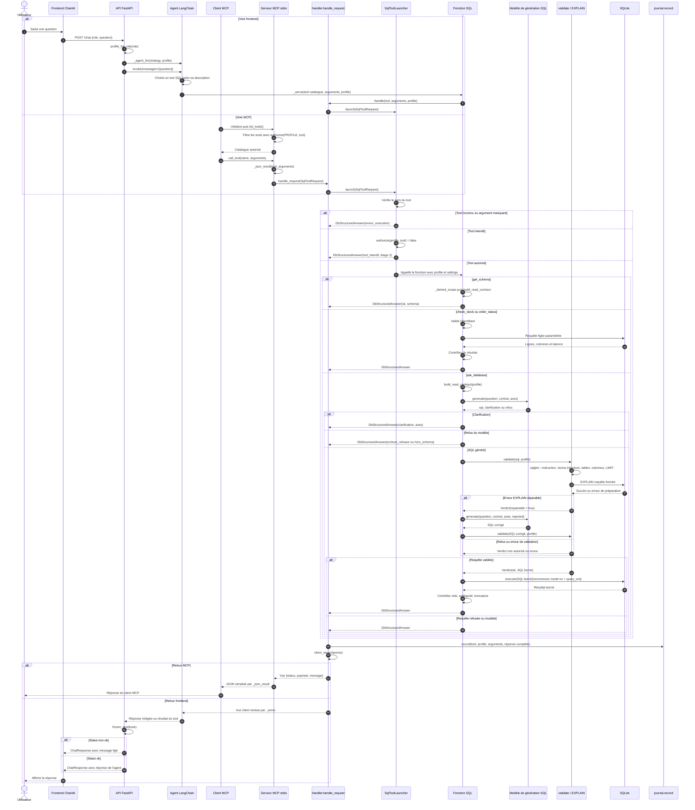

# Flux Text-to-SQL

Ces diagrammes décrivent le code présent dans le dépôt. Le Text-to-SQL possède deux façades distinctes :

- le banc d'essai frontend Chainlit, qui passe par l'API FastAPI et un agent LangChain ;
- le serveur MCP stdio, appelé directement par un client MCP.

Les deux façades convergent vers `packages.text_to_sql_factory.handler`, mais le frontend n'appelle pas le serveur MCP.

## Schéma du flux

### Points de lecture

- Les noms frontend sont des wrappers locaux : `ask_to_db` appelle le catalogue `ask_database`, `check_stock_by_ref` appelle `check_stock`, `order_status_by_id` appelle `order_status` et `get_db_schema` appelle `get_schema`.
- Le serveur MCP lit le profil dans `SORABEL_PROFILE`, tandis que l'API frontend convertit le rôle reçu avec `profile_for_role()`.
- `ask_database` donne au générateur uniquement le contrat de lecture du profil. La validation AST contrôle ensuite les tables, les colonnes, les écritures, la borne `LIMIT`, puis le moteur via `EXPLAIN`.
- Une erreur signalée par `EXPLAIN` peut provoquer une seule reprise du générateur. Un refus de matrice n'est pas renégocié.
- `journal.record()` reçoit la réponse interne complète avant `client_view()`. Les causes, traces et colonnes interdites restent donc hors de la vue client.

## Diagramme de séquence

Le code ne montre pas de frontend appelant `mcp_server.server` : les deux parcours sont donc représentés comme deux façades distinctes partageant le handler SQL.
